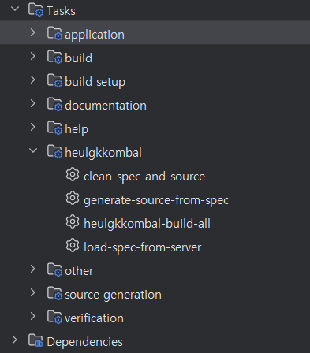
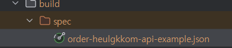
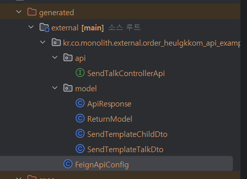

# heulgkkombal

참조 : https://github.com/OpenAPITools/openapi-generator

API Server : https://github.com/szjsk/heulgkkom

## 1. 프로젝트 소개
heulgkkom에서 생성된 api spec를 기준으로 각 프로젝트의 api를 소스로 생성해주는 프로젝트입니다.
open api를 활용하였으며 0.0.1버전 기준으로 feign만 지원됩니다.

### 테스트 방법.
build.gradle에 아래와 같이 추가합니다.
gradle 8.5 이상을 사용해야합니다.

```groovy
plugins {
    // ...
    id 'org.heulgkkombal.generator' version '0.0.1'
}

heulgkkombal {
    specApiUri = 'http://localhost:8079/spec/api-json' // heulgkkom 서버의 api spec 주소
    projectName = 'your-project-name' // 현재 적용된 프로젝트의 이름 (heulgkkom 서버에 등록된 이름)
    envType = 'dev or prod or when you want' // 환경 타입 (heulgkkom서버에 등록 시 입력한 이름. 운영배포시 파라미터를 활용하여 prod로 설정하도록 권장, 로컬 테스트시는 dev사용 권장 )
    invokerPackage = "kr.co.test.external" // 생성될 소스의 패키지명
    outputFolder = "build/generated/external" // 생성될 소스의 위치 프로젝트 루트부터 시작합니다. src로 시작해도 되나 build내 권장.
}


```
- 로컬에서 테스트 할 경우 version, id를 상황에 맞게 변경 후 현재 프로젝트를 publishLocal을 통해 로컬 레파지토리에 플러그인을 배포합니다. 


- 테스트 할 프로젝트에서는 settings.gradle에 아래와 같이 추가하여 플러그인을 로컬용으로 사용합니다. (로컬 레파지토리 사용)
```groovy
pluginManagement {
    repositories {
        mavenLocal()
        gradlePluginPortal()
        mavenCentral()
    }
}
```

- 성공 시 아래와 같이 Gradle에 heulgkkombal task가 추가됩니다.

  
clean-spec-and-source : spec와 생성된 소스를 삭제합니다.
load-spec-from-server : spec를 서버에서 다운로드 받습니다.
generate-source : spec를 기준으로 소스를 생성합니다.

(heulgkkom 서버가 실행중이어야 합니다.)

heulgkkombal-build-all : 위 3개 task를 순차적으로 실행합니다.

### 사용법
- load-spec-from-server 실행 시 
디폴트로 build\spec에 요청한 프로젝트명.json 파일이 생성됩니다.


- generate-source-from-spec 실행 시
  outputFolder에 소스가 생성됩니다.(소스 루트부터 시작) 
  삭제 및 커밋 시 오염을 방지하기 위해 build하위로 생성하는것을 추천합니다.
  커밋에 포함시키고자 한다면 src/하위로 생성하셔도됩니다. 

  build/에 생성되었다면 자바 소스로 인식하기 위해 build.gradle에 아래와 같이 추가합니다.

- build.gradle
```groovy
def externalDir = "$buildDir/generated/external" //heulgkkombal 프로퍼티의 outputFolder에서 설정한 경로

sourceSets {
    main.java.srcDirs += [ externalDir ]
}

clean.doLast {
    file(externalDir).deleteDir()
}
```
아래와 같이 해당 경로에 소스가 생성되면 성공입니다.


- 아직 테스트 중입니다.

## 2. 프로젝트 설명
생성된 파일은 기본적으로 Spring Configuration 어노테이션 설정이 되어있습니다.
인증은 각 프로젝트내 requestInterceptor에서 설정하시면됩니다.
하단 코드는 kkombal-generator/src/main/resources/templates/custom-feign/apiConfig.mustache를 기준으로 생성됩니다.
추후 opean api에서 지원되는 여러 언어를 사용할 예정이며 open api를 직접 수정하여 사용하셔도 됩니다.

``` java
@Configuration
public class FeignApiConfig {
	@Autowired
	private RequestInterceptor requestInterceptor; //custom auth instance

	@Bean
	public SendTalkControllerApi sendTalkControllerApi() {
		return Feign.builder()
				.decoder(new GsonDecoder())
				.encoder(new GsonEncoder())
				.logLevel(Logger.Level.FULL)
				.logger(new Slf4jLogger(SendTalkControllerApi.class))
				.requestInterceptor(requestInterceptor)
				.options(new Request.Options(10, TimeUnit.SECONDS, 60, TimeUnit.SECONDS, true))
				.target(SendTalkControllerApi.class, "http://localhost:8088");
	}
}
```

Feign 설정을 위해 build.gradle에 Feign라이브러리는 하단과 같이 직접 추가하셔야합니다.
```groovy
    implementation group: 'org.springframework.cloud', name: 'spring-cloud-starter-openfeign'
    implementation group: 'io.github.openfeign', name: 'feign-jackson'
    implementation group: 'io.github.openfeign', name: 'feign-gson'
```

